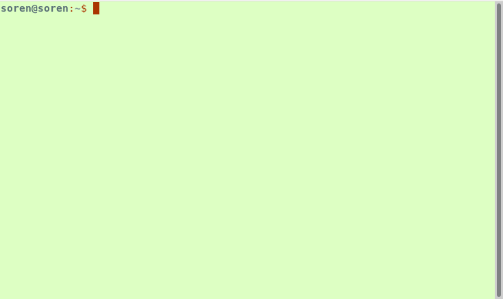
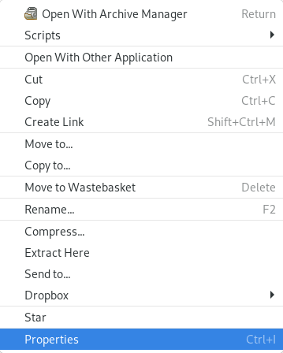

# Dealing with .jar files on linux

!!! note ""
	Mapeadora ([Geochicas](https://geochicas.org)) tradujo la página al español. El trabajo original en inglés fue desarrollado por Sören Reinecke ([Trufi Association](https://trufi-association.org))

## Installing Java

1. Abre una terminal oprimiendo la tecla de _WINDOWS_ de tu teclado y escribiendo `terminal` en la barra de búsqueda. Cómo funciona la barra de búsqueda depende del sistema de escritorio y del menú de inicio. Es posible que debas activarlo primero para comenzar a escribir.

2. Abre la terminal eligiendo la opción que aparece. La opción debe aparecer como `Terminal`,` Terminal GNOME` o `Terminal XFCE`, etc.

3. La ventana emergente debería verse similar a la mía:

4. En esta ventana, escribe `java -version` y presiona ENTER para verificar si ya está instalado. La mayoría de las distribuciones de Linux tienen Java instalado de forma predeterminada.

5. Si tu ventana tiene este aspecto, ya tienes instalado Java y puedes omitir _Instalar Java_:

6. Si tu ventana no parece ser como en la imagen anterior, entonces no tienes instalado Java. Es este el caso, necesitamos instalarlo:

   - Instalación en **Debian**, **Ubuntu** y similares como **Kubuntu**, **Xubuntu**:

     - Escribe `sudo apt install openjdk-11-jre`. Si esto arroja un error, intenta `su -c "apt install openjdk-11-jre"`. Cada comando que escribimos requiere que presione ENTER para procesarlo. Además, ambos comandos le solicitan su contraseña como:

     - Escribe tu contraseña. Es la contraseña de la cuenta root que configuraste durante la instalación o es la contraseña de tu usuario que utilizas para iniciar sesión en tu computadora (si no está desactivada). **Por razones de seguridad, no muestra lo que escribes. Ni siquiera ves un carácter `*` para cada carácter que escribes.**

     - Aparecerá un resumen de lo que estará haciendo el sistema y al final se te preguntará si estás dispuesto a aplicar estos cambios.

     - Escribe `Y` y presiona ENTER. Ahora descargará e instalará Java. Si conoces 'apt', te ahorrarás mucho tiempo. Normalmente, como usuario de Windows, tendrías que ir al sitio de descarga, descargar el instalador, ejecutarlo y seguir las instrucciones de instalación. En Linux, esto no es necesario.

   - Instalación en **Red Hat** y similares e.g. **Fedora**, **Oracle Linux**:

     - Escribe `sudo yum install openjdk-1.8.0-jre`. Cada comando que escribimos requiere que presione ENTER para enviarlo a su procesador. Además, te solicitará tu contraseña.

     - Escribe tu contraseña. Es la contraseña de la cuenta root que configuraste durante la instalación o es la contraseña de tu usuario que utilizas para iniciar sesión en tu computadora (si no está desactivada). **Por razones de seguridad, no muestra lo que escribe, ni siquiera un carácter `*` para cada carácter que escribes.**

     - Aparecerá un resumen de lo que el sistema estará procesando y al final se te preguntará si estás dispuesto a aplicar los cambios.

     - Escribe `Y` y presiona ENTER. Ahora descargará e instalará Java. Si conoces 'yum', te ahorrarás mucho tiempo. Normalmente, como usuario de Windows, tendrías que ir al sitio de descarga, descargar el instalador, ejecutarlo y seguir las instrucciones de instalación. En Linux, esto no es necesario.

   - **ToDo:** _Add more Linux derivatives_

## Installing JOSM

En este punto ya no necesitas la Terminal.

1. Descarga JOSM [aquí](https://josm.openstreetmap.de/). 

2. Guárdalo en tu computadora o dispositivo de almacenamiento portátil. Guárdalo donde quieras.

3. Con tu buscador de archivos ve a la ubicación donde descargaste el archivo. Haz clic derecho en el archivo descargado anteriormente y haz clic en _Properties _:

4. Dirígete a la sección _Permissions_ y marca la casilla _Permitir ejecutar el archivo como programa_:

5. Puedes cerrar la ventana y hacer doble clic en el ícono del programa, debería abrir JOSM. Si JOSM no se abre, pero aparece una ventana emergente y ves algunos botones entre cuales uno dice "Ejecutar", haz clic en ese botón y JOSM debería abrirse.
