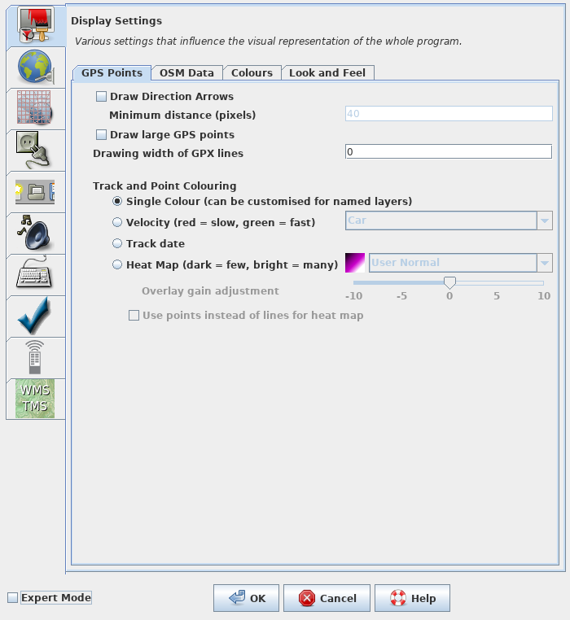
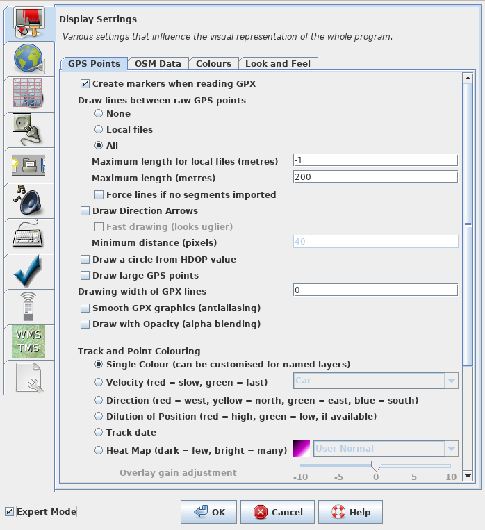
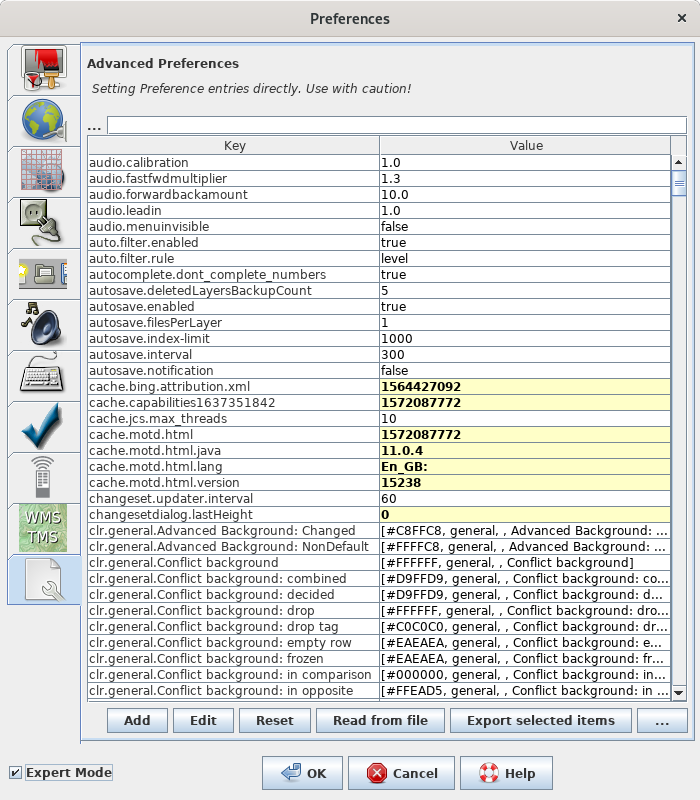
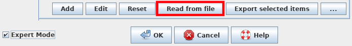
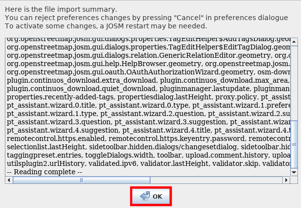
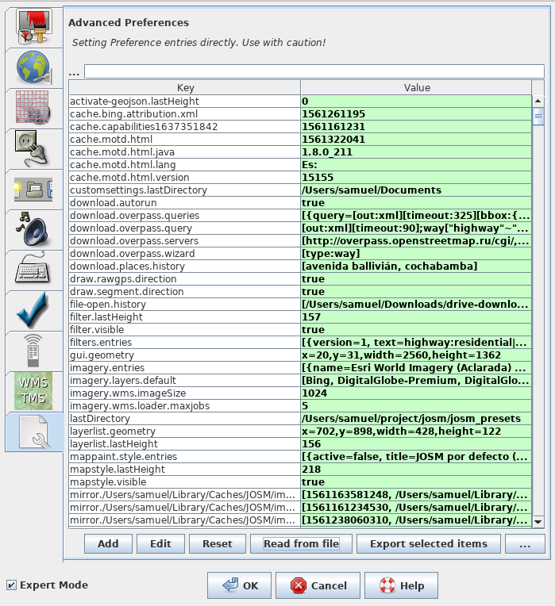
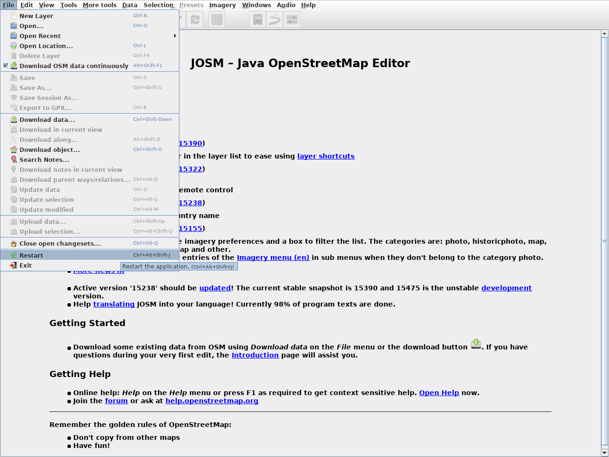

# Herramienta para mapear las rutas de autobuses

!!! note ""
	JAAS ([OSM Latam](https://wiki.openstreetmap.org/wiki/ES:OSM_Latam)) tradujo la página al español. El trabajo original en inglés fue desarrollado por Sören Reinecke ([Trufi Association](https://trufi-association.org))

La herramienta que instalaremos permite mapear fácilmente las rutas de autobuses en los países en desarrollo. Claro que esta herramienta puede ser utilizada igualmente en países desarrollados. La herramienta que instalaremos juega un papel importante en nuestra meta de mapear las rutas del transporte público y de crear interés en las comunidades para que las mantengan. Este tutorial asume que usted ya cuenta con el editor JOSM instalado y funcionando, así como el archivo de configuración (`.xml`) de su comunidad.

1. Asegúrese de tener la herramienta (el archivo de configuración con la extensión `.xml`) utilizado por su comunidad. Pídalo si usted aún no cuenta con este. Normalmente lo dirigirán al tutorial acerca de para qué sirve este archivo.

2. Abra JOSM (este tutorial asume que lo tiene ya instalado). 

3. Seleccione Editar --> Preferencias o seleccione sobre el ícono: 

4. Se abre una pantalla que se ve así: 

5. Ahora activaremos el _Modo Experto_ al seleccionar la casilla abajo a la izquierda: 

6. La pantalla cambia de esta forma: 

7. Seleccionamos sobre el último ícono de la barra a la izquierda: 

8. La pantalla cambia a algo similar a esto: 

9. Ahora seleccionamos sobre _Read from file_: 

10. Ahora podemos seleccionar el archivo que hemos descargado en el **paso 1** navegando a su ubicación y seleccionándolo.

11. Al finalizar el proceso de la importación oprima _OK_ 

12. Ahora la pantalla se verá así: 

13. Cerramos esta pantalla seleccionando _OK_: 

14. Ahora debemos reiniciar JOSM seleccionando sobre _Edit_ --> _Restart_ u oprimiendo _Ctrl+Alt+Shift+J_:

15. Toma un rato reiniciarse, pero ya lo hemos logrado. Ya contamos con las herramientas que necesitamos. Podrá notar los cambios que se han realizado en el GUI.
