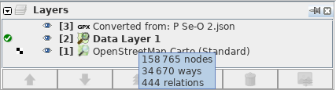

# Explicando _Capas_ en el editor JOSM

!!! note ""
	Yoviajo ([OSM Bolivia](https://wiki.openstreetmap.org/wiki/Bolivia)) tradujo la página al español. El trabajo original en inglés fue desarrollado por Sören Reinecke ([Trufi Association](https://trufi-associatio

Puede haber visto esto antes y puede puede preguntarse para qué es.

La entradas allí representan el orden. El primero en la cima ( _Converted from: P Se-O 2.json_ ) es aquel que será mostrado encima de las otras capas _Data Layer 1_ y _OpenStreetMap Carto (Standard)_.

Como regla para decidir el ordenamiento: La capa que contiene más datos es aquella que está abajo en la lista (aquí: _OpenStreetMap Carto (Standard)_ ). La capa que contiene menos datos está en la cima de la lista (aquí: _Convertido de: P Se-O 2.json_).

- Imágenes como *OpenStreetMap Carto (Standard)* están usualmente abajo en la lista porque son un montón de imágenes y las imágenes contienen bastantes datos. La imágenes son también llamadas _underline map_.

- Representaciones de datos OSM que puede modificar y cargar como _Data Layer 1_ están usualmente en el medio o en la cima de la lista. Esta es la capa que contiene la mayor parte de datos después de las imágenes.

- Cuando agregue datos externos que recibió de autoridades a OSM entonces tiene algo como *Convertido de: P Se-O 2.json* al tope de la lista porque usualmente contienen sólo los conjuntos de datos especificados y no todo. Esto significa que usualmente no contienen muchos datos.

Dentro de la tabla puede arrastrar y soltar filas individuales (entradas) para cambiar su posición en la lista o selccionar una entrada y luego clic uno de los botones flecha.

- Recomiendo el siguiente orden de arriba a abajo:
  
  - Conjuntos de datos externos recibido por autoridades.
  
  - Datos ya en OSM
  
  - Imágenes

Seleccionar una entrada (capa) y luego hacer clic en el botón con el símbolo _Basurero_ borra la capa seleccionada. **Cuide de no perder ningún cambio realizado en los datos que la capa representa.**

Hacer clic en el botón con el símbolo _ojo_ activa/desactiva la capa. Lo que significa que cambia su visibilidad en el mapa.

