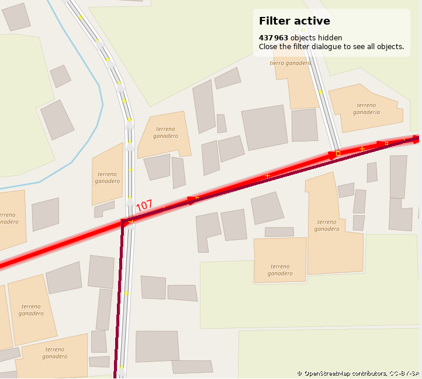
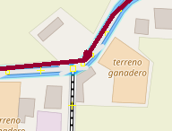
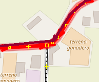

# Barra superior: _Herramientas_ en JOSM

!!! note ""
	Yoviajo ([OSM Bolivia](https://wiki.openstreetmap.org/wiki/Bolivia)) tradujo la página al español. El trabajo original en inglés fue desarrollado por Sören Reinecke ([Trufi Association](https://trufi-association.org))

Puedes haber visto

y te preguntas de qué se trata. Aquí te daré una vista general rápida.

## Preparando para que la herramienta sea útil

1. Necesitamos una vía una posición con la cual realizar acciones. La selección se volverá roja como

    Manteniendo presionada la tecla SHIFT y haciendo clic en otras vías podrás seleccionar más de una vía. Esto es necesario para que algunas funciones sean útiles.

2. Hacemos clic en _Herramientas_ en la barra superior: 

3. Entonces tenemos las siguientes opciones dependiendo de nuestra selección:

   - **Particionar vía**: Usado para crear dos vías a partir de una vía. Esto es útil cuando agregas una ruta a OSM y una vía es más larga que la ruta que sigue. Usualmente querrás partir en la posición donde la línea roja oscura toma su propio camino. (vea el gráfico arriba). Vea también mi [tutorial dedicado ](../split-ways/index.md).
   - **Combinar vía**: Usado para crear una vía a partir de dos vías. Es lo opuesto de la funcionalida _Particionar vía_. Para que esta funcionalidad sea efectiva necesitarás dos vías seleccionadas manteniendo presionada la tecla SHIFT y seleccionándolas.
     - No Seleccionado: 
     - Seleccionado: 
   - **Invertir dirección**: Usado para invertir la dirección de una o más vías. Esto sólo cambia la dirección técnica como los datos fueron ingresados (comenzando a dibujar la vía de izquierda a derecha o al revés). Los mapeadores usan esta herramienta sólo para hacer más limpios los datos técnicos. Esta funcionalidad no afecta la interpretación de los datos, no afecta las etiquetas. **Probablemente no la necesitas.**
   - **Simplificar vía**: Usado para quitar nodos innecesarios de una vía. Técnicamente un montón de nodos conectados unos al otro en un orden específico representan una vía. Esta es otra opción para hacer que se vean mejor los datos OSM, no afecta las etiquetas de la vía. Los nodos sobre una vía usualmente no tienen etiquetas (están vacíos).
   - **Alinear nodos en un círculo**: Esta función hace lo que dice. Esta es otra funcionalidad que raramente necesitarás.
   - **Alinear nodos en una línea**: Útil si tienes un montón de nodos como diferentes puntos en un sistema de coordendas en matemáticas (e.g. representación de datos como una _nube_.) en un umbral especificado e.g. dentro de un rango de 0,5cm y quieres crear una línea a partir de este nodo, entonces esta función es para ti.
   - **Distribuir Nodos**: Distribuye los nodos existentes sobre una vía de manera equidistante.
   - **Ortogonalizar Forma**: Ajusta todos los ángulos internos de una forma en valores de 90 grados.
   - **Seguir línea**: Para que esto sea efectivo necesitas dos vías seleccionadas. Una vía puede compartir nodos con otra línea. Esta función continua dibujando esa línea.
   - **Agregar nodo**: Una vía es una representación de nodos conectados entre ellos en un orden lineal ordenado. Esta función agrega un nodo a la vía seleccionada y te pide ingresar sus coordenadas.
   - **Mover nodo**: Selecciona sólo un nodo para que esta función sea efectiva. Te pide ingresar sus nuevas coordenadas.
   - **Crear círculo**: Similar a la función _Alinear nodos en un círculo_ pero trabaja con sólo tres nodos.
   - **Fusionar nodos**: Para que esto sea efectivo necesitas sólo seleccionar los nodos de manera de fusionarlos juntos: Fusionando sus etiquetas.
   - **Unir nodo a la vía** Arregla la unión del nodo y vía seleccionados.
   - **Mover nodo sobre la vía**: Mueve e incluye el nodo seleccionado a la vía más cercana.
   - **Desconectar nodo de la vía**: Arregla la separación de un nodo o vía seleccionados.
   - **Despegar vías**: Duplica nodos compartidos por más de una vía.
   - **Unir áreas sobrepuestas**: Une un área (vía cerrada) que se sobrepone con otra área en esa área.
   - **Crear multipolígono**: Crea un multipolígono a partir de la selección de vías y nodos. Un multipolígono permite la exclusión de algo dentro de él y es útil en casos donde algo está en un área de una vía cerrada pero que tiene sus propios límites para hacer que sea más ingresar.
   - **Actualizar multipolígono**: Similar a la función previa pero actualiza el área con la vías y nodos seleccionados.
