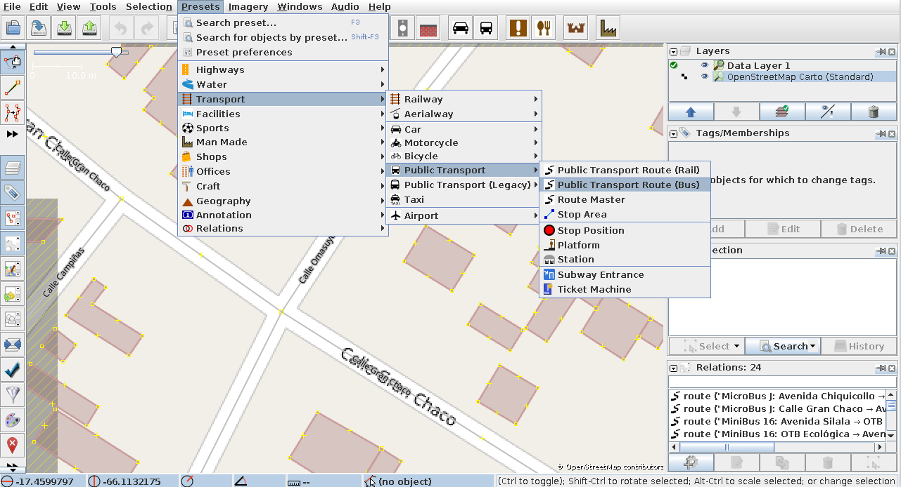

# Mapear rutas de transporte informal

!!! note ""
	Mapeadora ([Geochicas](https://geochicas.org)) tradujo la página al español. El trabajo original en inglés fue desarrollado por Sören Reinecke ([Trufi Association](https://trufi-association.org))

Este tutorial muestra cómo agregar rutas de transporte informal a OpenStreetMap. Para poder hacerlo debes primero tener [JOSM instalado](../installing-josm-on-linux/index.md) así como la [herramienta custom mapping tool](../installing-mapping-tool/index.md) (si requerido por tu comunidad). Para subir los cambios a OSM, necesitas tener JOSM [sincronizado](../oauth-josm/index.md) con tu cuenta de OpenStreetMap.

## Preparar un espacio de trabajo

1. Abre JOSM (en este tutorial se asume que ya lo tienes instalado). 

2. Una ventana debe abrirse, como sigue 

3. Debes cargar primero los datos que recibiste de tu comunidad. Haz clic en _File_ en la barra superior: 

4. Luego haz clic en _Open_ desde el menú: 

5. Una caja de diálogo se abre, selecciona el archivo de tu comunidad. Ve a la ubicación donde guardaste el `*.geojson`, haz clic en este archivo y ábrelo con _Open_:

6. Espera que el proceso de carga haya terminado. Cuando terminó, la interfaz cambia, puedes ahora ver el editor: 

7. Antes de comenzar el mapeo, necesitas preparar el editor y cargarle los datos de OSM. Carguemos primero los datos de OSM. Haz clic de nuevo en _File_ en la barra superior: 

8. Y luego en _Download data..._: 

9. Empezamos a amar las ventanas emergentes. En ésta, probablemente no necesites ajustar el cuadro y límites que ves en el mapa porque JOSM hizo esto para tí ya que se adecuó al `*.geojson` que cargaste: 

10. Haz clic en _Download as new layer_. Si aparece que el área seleccionada es demasiado grande, cambia su tamaño volviendo a ese cuadro de diálogo, haz clic y arrastra el mouse sobre una parte más pequeña del área previamente seleccionada. Suelta el mouse para crear nuevos límites. Repite hasta que el sistema acepte el área seleccionada :)

11. Esto se ve mejor: 

12. Pero aún no estamos satisfechos, ¿verdad? Para tenerlo aún mejor, debemos agregar los mosaicos de OSM. Ve a _Imagery_ en la barra superior y luego seleccia _OpenStreetMap Carto (Standard)_. Magnífico, ¿no?

13. Echemos un vistazo rápido a la sección _Layers_ en el sitio superior derecho del editor.

    

    Por cierto, puedes cambiar el tamaño de las ventanas haciendo clic en los límites respectivos y arrastrándolos a la posición que desees.

15. El nombre del bloque se ve ahora así: 

16. Haz clic en el bloque de nuevo y selecciona

    - _Customize Colour_ primero,

    - Luego _Download from OSM along this track_

    - Y finalmente _Precache imagery tiles along this track_.

17. Haz clic de nuevo en el bloque y selecciona _Customize track drawing_, una nueva ventana emergente aparece: 

18. En el campo de texto pegado a _Drawing width of GPX lines_, escribe la medida deseada de ancho en pixeles. Te recomiendo `5`. Y haz clic en _Okay_.

19. Oprime ALT+SHIFT+F1 para detener automáticamente la descarga de datos mientras te mueves en el mapa. En paralelo, haz clic en _File_ en la barra superior y luego _Download OSM data continuously_. Es una palanca. Luego, navega dentro del mapa hasta el final de la línea. Para navegar en el mapa, debes mantener presionada la tecla derecha del mouse mientras mueves el mouse. Usa la rueda del mouse para acercar o alejar el zoom. **La línea tiene dos extremidades: _inicio_ y _final_. Selecciona la que tiene la flecha que abre, no la flecha que cierra.**

    - Final <-- Inicio

    - 

## Preparar los datos de OSM a lo largo de la ruta que quieres agregar

Antes de comenzar, necesitamos trabajar un poco los datos de OSM. En la última imagen puedes ver la línea de color rojo oscuro y la azul. La primera línea es la ruta del autobús y la segunda es la calle en OSM donde circula el autobús. Esta parte del tutorial muestra cómo convertir la primera línea en datos útiles.

Presiona ALT+SHIFT+F1 para parar/iniciar la descarga automática de datos mientras te mueves en el mapa. En paralelo haz clic en *File* en la barra superior y luego *Download OSM data continuously*. Es una palanca. Cuando te muevas en el mapa en un área donde no hay datos disponibles, enciende la palanca _Download OSM data continuously_. Si usas mucho la función de zoom, entonces mejor apaga esta palanca _Download OSM data continuously_.

1. Selecciona la línea que no es la roja más oscura, pero la que está alineada a ella: 

2. No vemos que toda la línea se ponga roja. Lo que nosotros vemos como una sola línea (la azul), son dos diferentes, porque la línea se ha dividido en el punto donde _Calle Campinas_ cruza la línea que seleccionamos.

3. Queremos crear una ruta, por lo que damos clic en el ícono de línea en la barra de símbolos justo debajo de la barra de herramientas: 

4. Una ventana emergente se abre, que te solicita los datos que recibiste de tu comunidad. Escribe los datos en los campos correspondientes y haz clic en _Okay_. Se abre una nueva ventana con una descripción general: 

5. En el sitio de la derecha, verás una lista de todos los objetos (calles) que has seleccionado en el editor JOSM. En el sitio de la izquierda, verás una lista de todos los objetos (calles) ya agregados a la relación. **¡No cierres este diálogo, lo vamos a necesitar!**

6. Selecciona otras calles a lo largo de la línea rojo oscuro, ve al diálogo de nuevo y haz clic en el bloque resaltado en rojo, donde seleccionas la última fila de tus cuatro filas, para agregar la selección a la lista de rutas en el sitio derecho. Puedes seleccionar varias calles a la vez manteniendo presionada la tecla de mayúsculas.

7. Repite el paso _6_ cuando llegues allí: 

8. _¡Ups, tenemos un problema!_ Lo que se debe hacer ahora es fragmentar el camino. Haz clic en el mapa para deseleccionar. Asegurate de añadir todas las calles a excepción de la vía en cuestión en la ruta de transporte, como en el paso _6_.

9. Selecciona la calle (way) en cuestión. Acércate con el zoom al punto donde vas a fragmentar la línea:  Zoom in (vista del corte):

10. Selecciona la calle (aquí en azul).

11. Oprime la tecla de mayúsculas. Selecciona el cuadrado (JOSM lo ilumina en amarillo) mientras sigues oprimiendo la tecla.

12. En la barra superior haz clic en _Tools_ y luego en _Split way_. Luego, oprime la tecla _P_. Una caja de diálogo te pedirá decidir para cual segmento de la vía conservar el histórico. Ignóralo y haz clic en _Okay_. Deselecciona todo, dando clic en cualquier espacio en blanco en el mapa.

13. Continúa con el paso _6_ hasta el final de la línea rojo oscuro.

14. Una vez terminada la línea rojo oscuro, casi has acabado. Ahora necesitamos validar tu trabajo. Para ello, dirígete a la caja de diálogo que dejaste abierta durante todo el proceso de mapeo.

15. Deberías consultar a alguien sobre validación si no eres familiar con este proceso. Es una parte crítica. Echa un ojo a las diferentes opciones que te ofrece la caja de diálogo.

    - Selecciona una opción de la lista a la izquierda. Haz clic derecho y acércate con el zoom _Zoom to_ hacia este objeto en el mapa. Usa este método para reparar objetos, teniendo el siguiente símbolo, o parecido:

    - Usa el _Zoom to_ y el mapa para encontrar caminos faltantes (calles), y desplaza el mouse sobre los botones del área resaltada en rojo junto a la tabla _selection_ y ve qué pasa.

    - El color negro es tu amigo :) Todo lo que se pinta de negro en la línea de validación significa que los datos son correctos.

    - El primer y el último punto de la ventana de diálogo muestran un símbolo rojo en la línea de validación, porque uno de los extremos no está conectado a la otra calle. Solo es lógica: una ruta de bús siempre termina en algún lado.

16. En el cuadro de diálogo de la lista de rutas, haz clic en _Ok_ para crear esa ruta, cuando creas que has terminado.

17. Haz click en el ícono _Upload icon_ en la barra de símbolos debajo de la barra superior: 

18. Ignora la ventana de diálogo _Suspicious data found_ cuando se abre, o repara los problemas. Informa tu comunidad sobre los problemas que has encontrado, y sobre las ediciones que has hecho.

19. Una nueva ventana se abre: 

20. Llena la información requerida y haz clic en _Upload Changes_ para concluir el proceso de subida de la información.
