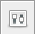
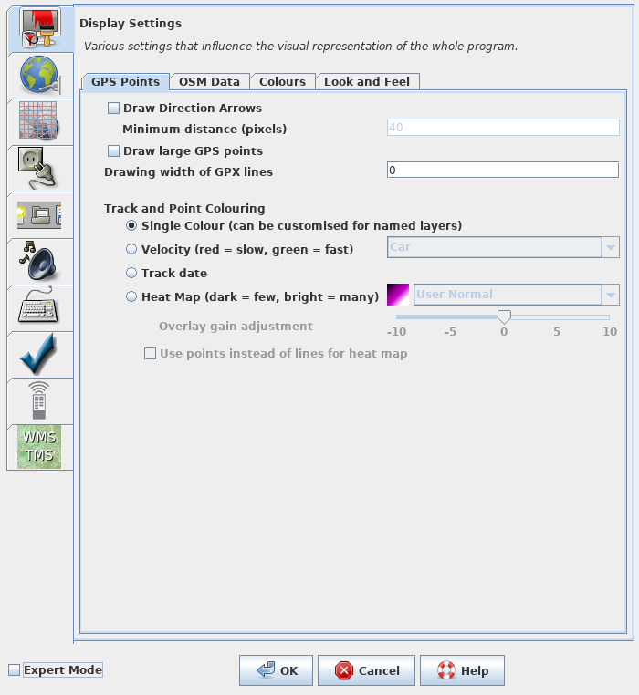
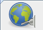

# Cómo enlazar su cuenta OpenStreetMap con JOSM

!!! note ""
	Yoviajo ([OSM Bolivia](https://wiki.openstreetmap.org/wiki/Bolivia)) tradujo la página al español. El trabajo original en inglés fue desarrollado por Sören Reinecke ([Trufi Association](https://trufi-association))

Hoy vamos a enlazar JOSM con su cuenta OSM de manera de que pueda subir cambios desde dentro de JOSM que es lo que queremos. Quizás la configuración para esto ha sido realizada por su comunidad permitiéndole establecer el [archivo de configuración JOSM](../installing-mapping-tool/index.md) o haciéndolo por usted. Sólo siga las instrucciones que se le diga aquí ya que hacerlo de otra manera podría dañar algo.

1. Abra JOSM: 

2. Clic en el en símbolo _preferencias_:

3. La ventana que se abre se parece a esto: 

4. Clic en el símbolo para _Ajustes de la conexión_: 

5. Luego clic en el botón aquí resaltado en rojo: 

6. Se abre una nueva ventana y se ve así: 

7. Ingrese su nombre de usuario OSM en el primer campo que está resaltado rojo.

8. Luego su Contraseña OSM en el segundo campo resaltado rojo.

9. ¿Finalizó de escribir sus credenciales? Entonces clic _Autorizar ahora_ justo abajo del último campo de texto.

10. Espere un momento para que se complete la transferencia. Un resumen del proceso de autorización debería aparecer así: 

11. Clic en _Aceptar Token de Acceso_ para darle un buen término.

12. Ahora su ventana de _Ajustes de Conexión_ se ven así: 

13. Clic _aceptar_ para cerrar este diálogo. Ahora JOSM está enlazado a su cuenta OSM y puede comenzar a mapear y mejorar el mapa ya mismo. Yupi :)
